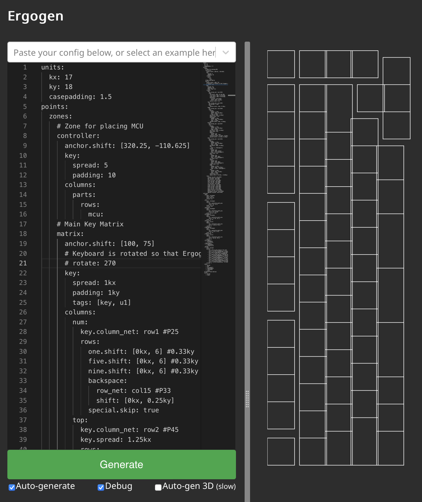
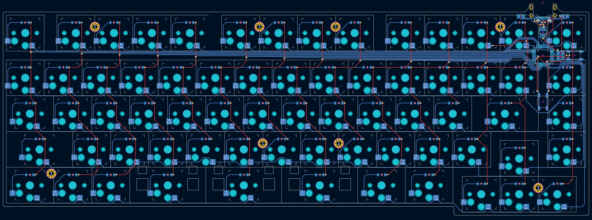
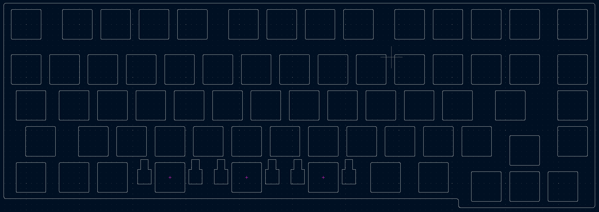

# 65 Crimes, a CH559L FAK Keyboard

This is a 65% keyboard with the heart of a 40% keyboard. Nothing here is standard. It's not ergonomic. I have to be breaking some sort of keyboard law here. Welcome to the 65 Crimes.

The 65 Crimes is my take on a small row-staggered keyboard design. I've been getting into retro computing a bit more lately, and I wanted a non-ergonomic non-split keyboard design that didn't rely on a ton of layers. The 65 Crimes can play TiE-Fighter with the `F1`-`F12` keys being the only thing you need to hold `Fn` down for. I still wanted the keyboard to be compact and tweet however, so there's a few odd quirks going on here. The left row has been shaved down by half a key width. `Tab`, `Caps Lock`, and `Left Shift` all get downgraded from 1.5u to 1u, 1.75u to 1.25u, and 2.25u to 1.75u. Much more striking however is the number row. Rather than sticking with the popular compact 65% keyboard block design, I gave the number row a bit of breathing room. It's spaced out similar to a traditional function row. It makes it a little odd to type on, but the end result is a 65% keyboard that looks like a 75% keyboard at first glance.

I tackled a few personal firsts on this keyboard design. It's my first row-staggered keyboard, my first keyboard with spacebar stabalizers, my first keyboard with an onboard microcontroller, and my first time working with the FAK keyboard firmware. Everything worked out in the end, but there were a lot of layered learning experiences here.

## The Ergogen Layout

This one's going to take some explaining.

Ergogen is a keyboard layout generator designed to make ergonomic keyboards. It's right there in the name! It's designed to make "column staggered" keyboards where all of the keys in a column (QAZ, WSX, etc.) are aligned together. This is a traditional "row staggered" keyboard. It's ostensibly less ergonomic. It's also something Ergogen is *really* not designed for.

To design the 65 Crimes keyboard I needed to get a little creative. The Ergogen config file for this board literally turns it on its head. Everything is rotated 90 degrees so that it just looks like an excessively tall column staggered keyboard. Rather than a 15 column, 5 row keyboard, Ergogen thinks it's designing a 5 column, 15 row keyboard.

The approach takes a bit to wrap your head around. X becomes Y, length becomes width, and straightforward becomes tedious. This is definately a case of, "When you have a hammer, everything looks like a nail". If you're familiar with Ergogen then this approach is still probably faster than learning another tool. If you're looking to learn Ergogen to make a row-staggered keyboard however, you're probably better off looking at some of the [other](https://github.com/jeroen94704/klepcbgen) [tools](https://kb.xyz.is) out there.

## The PCB

At its core, the 65 Crimes keyboard was an excuse to learn more about building keyboards with built in microcontrollers. The Arduino Pro Micro, RP2040, Nice!Nano, and XIAO boards are great, but it's hard to beat some of the minimalist designs you can build when you're not trying to hide a large postage stamp sized microcontroller somewhere. I briefly explored some of the options out there for built in microcontrollers, but they all seemed to have a level of complexity I wasn't ready to dive into. I got fairly far along looking at STM32-based designs, but the programming headers just seemed like a headache I didn't want to deal with.

Enter the CH55X line of chips. These budget microcontrollers became popular during the Covid chip storage era. They're not going to win any performance contests, but they're cheap, easy to source, and have onboard USB support. The later is naturally beneficial for keyboard builders, but there's a few other nice touches here. CH55X chips have fairly simple circuit designs. You only need a half-dozen resistors and capacitors to get these chips up and running. These chips are also completely hand-solderable if you'd like to skip an expensive PCBA asembly step. Even the basic flashing is nice and straightforward. The same USB port you use for connecting to the keyboard is used for flashing the firmware. (Similar to an Arduino Pro Micro.) Instead of tapping the reset button twice, you simply need to add and hold down a dedicated "Boot" button.

The majority of keyboards with CH55X chips are using the smaller CH552T chip. It has a nice hand-solderable 0.65mm pitch chip package. Unfortunately, it doesn't have enough pins for the 65 Crimes large 67 key layout. Thankfully the CH559L has more than enough pins for this design. Things get a little trickier on the hand soldering front however. The CH559L has a tighter 0.5mm pitch. It's nothing a little flux can't deal with, but you may want to buy a few spares if this is your first time working with SMD soldering.

Again, this is my first time working with an onboard microcontroller or the CH55X family of chips. All of the pinouts and component choices are shamelessly copied from semickolon's [Partycrasher Micro](https://oshwlab.com/kkpjfobj/partycrasher-micro) microcontroller design.

## The Firmware

One slight catch with the CH55X chips is that they can't run most of the popular keyboard firmwares. QMK and ZMK won't run on this particular microcontroller. Instead, the 65 Crimes leverages the relatively new [FAK keyboard](https://github.com/semickolon/fak) firmware.

I didn't dive deep into it, but my first impression of FAK has been great. It's a declarative keyboard firmware that should be familiar for anyone who's worked with ZMK. It's nice having a purely functional firmware which throws errors at compile time if you've accidentally made an issue with your keyboard config.

FAK can be built locally on your computer, but they also offer a preconfigured Github Codespace as a build enviornment. It makes things nice and simple to get your first firmware up and running. The only package you need to run locally is the flashing utility `wchisp`, which offers precompiled binaries for Windows, Mac, and Linux.

The keymap for 65 Crimes can be found in this repository's `/fak-config` folder. I haven't used any FAK features other than layers to enable a basic `Fn` key. For more advanced ergo keyboards however, FAK supports all the usual macros, combos, encoders, split keyboards, mouse keys, sticky layers, and tap dancing you're accustomed to. Their [Discord](https://discord.gg/4Ev8GFZNR2) was incredibly welcoming and patient with all my questions.

## The Switch Plates

The 65 Crimes keyboard is also the first time I've designed a keyboard layout that uses stabilizers. These are those small metal bars which help wide keys press down evenly without any wobble. They're ubiquitous in the world of row staggered MX keyboards, but a bit less common in the Choc space.

Choc stabalizers require a switch plate. The plastic anchors need to be sandwiched between two layers of PCB (or other stiff material) to seat correctly. Thankfully Ergogen makes it pretty straightforward to make a switch plate. Fire up your PCB's outline, cut out a 14mm hole on each switch, add the stabilizer cutouts, drop in some mounting holes, and bam you're done. Unfortunately the 65 Crimes is a somewhat large keybaord by split ergonomic standards. JLCPCB wanted another $15 USD for the full switch plate.

I experimented with making a cheaper stabalizer "shim". This was a smaller piece of PCB material that only covered the spacebar keys and the left and right modifiers next to them. The idea was that you could print off this smaller piece and save a few bucks during your prototyping.

The actual stabalizer footprints come from a design put together by [FKCaps](https://github.com/FKcaps/mbk-footprints/tree/main). The cutout isn't symetrical with the key switch and is aligned closer to the top edge. This resulted in the shim having a relatively thin piece of PCB material. JLCPCB wanted an extra $7 USD to make sure the hole was routed properly. Rather than iterating on this design further, I went ahead and just printed out the full switch plate. The switch plate worked great the first time thankfully, but I'm leaving the shim designs in here for anyone who's interested.

For this particular build I went with [Chosfox's CFX WoB Keycap Set](https://chosfox.com/collections/low-profile-keycaps/products/chocfox-wob). I wanted a keycap set with legends, and this layout used a few odd sized 1.25u and 1.75u keycaps for the modifiers, tab, and enter key. This left Chosfox as pretty much the only game in town. The keycap set is split into an Alpha, Ergo, and Extras kit. I was *barely* able to squeak by with just the Alpha and Ergo kits.

The Ergo CFX kit comes with two 2u spacebar keys. It also comes with a 2u key labeled "Shift". There are also two bright orange 3u spacebar keys. I asked around online and didn't get many strong opinions when it came to using three 2u spacebars or two 3u spacebars.

My final design went with three 2u spacebars. This mostly came down to parts sourcing. It turns out the 3u Choc stabalizers are *really* hard to source right now. I ended up getting five 2u Choc stabalizers from [LowProKB.ca](https://lowprokb.ca/collections/parts/products/kailh-choc-stabilizers) for about $5 USD plus $7 USD shipping. I could have purchased 3u stabalizer wires from [CannonKeys](https://cannonkeys.com/products/stabilizer-wires?variant=40921516540015) for $4 USD plus $4 USD shipping if I really wanted to use the larger 3u CFX keycaps. Instead, I just ended up purchasing three [MBK 2u convex spacebars](https://lowprokb.ca/products/mbk-low-profile-pbt-blank-keycaps?variant=44794533707940) from LowProKB for an extra $3 USD. It sounds a little silly to say I went with three 2u spacebars to save $5 USD, but I already happened to have a matching purple Esc key from an earlier FK Custom order.

It's worth noting that these Chosfox keycaps use their "CFX" spacing *only on their 1u keycaps*. These CFX keycaps have become popular for minimally spaced keyboards. Standard MBK keycaps are 18mm x 17mm, while the CFX keycaps are a square 17mm x 17mm. That's a free 14mm of saved width on a keyboard like this. Unfortunately the other 1.25u, 1.5u, 1.75u, and 2u keycaps stick to their standard MBK spacing. (That is to say the 1.5u keycap is 18mm * 1.5 mm wide.) For that reason this keyboard sticks to standard Choc spacing.

The `footprints` folder contains several custom footprints. Getting the spacing right on this was tricky, so I created a full line of `choc-Xu` footprints to show their exact spacing on the PCB. The `choc-stab-2u` and `choc-stab-2u-cutout` footprints are based on footprint designs by [FKCaps](https://github.com/FKcaps/mbk-footprints/tree/main).

## The Case

After all the other experimentation with this keyboard, I stuck with what has worked for me in the past with the 65 Crimes case design. It uses my standard "Tray" design. The PCB and switch plate have mounting holes, and the case has standoff legs with heat set inserts. The only thing I did different this time was splitting the case in half to fit on my printer, and making the sides of the case a bit taller on the top and sides for aesthetic purposes. I also decided to fire up Cura's "Fuzzy Skin" setting.

## The Build (and Lessons Learned)

No long build guide this time unfortunately. There were a few false starts and fiddling with this keyboard, so I don't have step-by-step pictures to share. Overall the build went smoothly. The CH559L was the trickiest piece to solder. You need to line it up percicely, apply a bit of solder flux to one side, then quickly apply a bit of solder while the chip is still aligned. Once one of the legs is soldered properly, you can drag-solder the rest as you would with any other SMD component. The same approach goes for the USB-C port. The ESD protection chip, two capacitors, and two resistors should be a bit more straightforward.

This wasn't my first rodeo when it came to working with SMD parts. Thankfully the TypePak has similiar sized components with just as tiny pitches. One slightly emberrasing learning experience was to *not trust the orientation of text on SMD packages*. I totally fried some of the ESD and CH559L chips by having things oriented the wrong way.

The "rotate everything 90 degrees in Ergogen" trick also nearly came back to bite me. It turns out swapping the col and row pinout definitions wasn't enough to compenstate for its rotated definition. All of the diodes on this keyboard are technically "backwards" from how I typically build them. Thankfully it didn't lead to anything more complicated than needing to swap the "ColToRow" variable in the FAK firmware to "RowToCol".

## Build of Materials

| Part                       | Amount | Price       | Link |
| -------------------------- | ------ | ----------- | ---- |
| 65 Crimes PCB via JLCPCB   | 1      | $35 USD Shipped (Shim), $50 USD Shipped (Switchplate) | https://github.com/ImStuBTW/65crimes |
| CH559L                     | 1      | $8 USD (For 5) | https://www.aliexpress.us/item/3256804321719097.html |
| Mid-Mount USB              | 1      | $1.00 USD   | https://www.aliexpress.us/item/3256805368744698.html |
| 5.1K Resistors             | 2      | $3.50 USD (Multi-Pack)   | https://www.aliexpress.us/item/3256806698117192.html |
| 3.3uf Cap                  | 1      | $1.00 USD   | https://www.aliexpress.us/item/3256806243569846.html |
| 100nf Cap                  | 1      | $2.00 USD (Multi-Pack)   | https://www.aliexpress.us/item/3256805970706203.html |
| USBLC6-2SC6 ESD Protection | 1      | $1.50 USD   | https://www.aliexpress.us/item/2251832337465783.html |
| 1N4148 T4 Diodes           | 67     | $2.00 USD   | https://www.aliexpress.us/item/2255800498728983.html |
| Choc Switches              | 67     | $45.00 USD  | https://lowprokb.ca/collections/switches/products/kailh-choc-low-profile-switches |
| Chocfox CFX Keycaps        | Alphas + Mods | $60.00 USD | https://chosfox.com/collections/low-profile-keycaps/products/chocfox-wob?variant=42753190461634 |
| MBK Spacebars (Optional)   | 3      | $3.00 USD   | https://lowprokb.ca/collections/keycaps/products/mbk-low-profile-pbt-blank-keycaps?variant=44794533511332 |
| 4mm M2 Screws              | 8      | $1.00 USD   | https://www.aliexpress.us/item/2255801062616407.html |
| M2 Screw Inserts           | 8      | $1.50 USD   | https://www.aliexpress.us/item/3256804349544912.html |
| Bumpons                    | 1 Pack | $10.00 USD  | https://www.amazon.com/Adhesive-Bumper-106-PC-Spherical-Square/dp/B06XPCLN23/ |