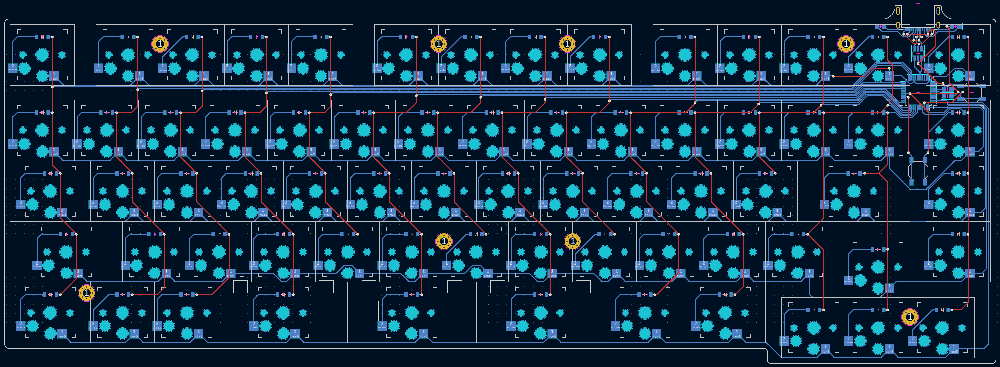

# 65 Crimes, a CH559L FAK Keyboard

## The Ergogen Layout

Alright, this one's going to take some explaining.

Ergogen is a keyboard layout generator designed to make ergonomic keyboards. It's right there in the name! It's designed to make "column staggered" keyboards where all of the keys in a column (QAZ, WSX, etc.) are aligned together. This is a traditional "row staggered" keyboard. It's ostensibly less ergonomic. It's also something Ergogen is *really* not designed for.

To design the 65 Crimes keyboard I needed to get a little creative. The Ergogen config file for this board literally turns it on its head. Everything is rotated 90 degrees so that it just looks like an excessively tall column staggered keyboard. Rather than a 15 column, 5 row keyboard, Ergogen thinks it's designing a 5 column, 15 row keyboard.

This is a novelty keyboard design. I've been getting into retro computing a bit more lately, and wanted a small keyboard which didn't use a ton of layers. This can play TiE-Fighter with the Function keys being the only thing you need to hold Fn down for. I still wanted the keyboard to be compact and twee however, so there's a few odd quicks going on here. First of all is the number row masquerading as a function row. We'll see how that feels to use in practice during a hectic Doom 2 run. The Tab, Caps Lock, and Left Shift keys have also all between traded out with keys that are 0.5u shorter.

This is a 65% keyboard with the heart of a 40% keyboard. Nothing here is standard. It's not ergonomic. I have to be breaking some sort of keyboard law here. Welcome to the 65 Crimes.

## The PCB

This keyboard was also an excuse for me to experiment with the new FAK keyboard firmware and it's counterpart line of budget CH55X chips. I've never built a keyboard with an onboard microcontroller before, and these chips are supposed to be somewhat more hand-solderable than previous keys. They don't need a ton of support hardware, so hopefully I didn't mess up the writing too much. All of the pinouts and component choices are shamelessly copied from semickolon's [Partycrasher Micro](https://oshwlab.com/kkpjfobj/partycrasher-micro) microcontroller design.

## The Switch Plates

The 65 Crimes keyboard is also the first time I've designed anything with stabilizers. The keyboard's spacebar is split across three 2u keys. Choc stabilizers need a switch plate to function, so I designed an accompanying switch plate for this board. Unfortunately this is a somewhat large keyboard by split ergonomic board standards, so the extra switch plate is a little expensive to fabricate. I also included an experimental keyboard stabilizer "shim" that only snaps onto the bottom 3 spacebars and their surrounding modifier keys.

For my particular build I went with Chosfox's CFX WoB Keycap Set. It's one of the only legend’d options for 1.25u, 1.75u, and 2u Choc keycaps. It also includes 3u spacebars. I opted to use the 2u spacebars simply because 3u Choc stabilizers were harder to come by when I was shopping.

It's worth noting that these Chosfox keycaps use their "CFX" spacing *only on their 1u keycaps*. These CFX keycaps have become popular for minimally spaced keyboards. Standard MBK keycaps are 18mm x 17mm, while the CFX keycaps are a square 17mm x 17mm. That's a free 14mm of saved width on a keyboard like this. Unfortunately the other 1.25u, 1.5u, 1.75u, and 2u keycaps stick to their standard MBK spacing. (That is to say the 1.5u keycap is 18mm * 1.5 mm wide.) For that reason this keyboard sticks to standard Choc spacing.

The `footprints` folder contains several custom footprints. Getting the spacing right on this was tricky, so I created a full line of `choc-cfx-Xu` footprints to show their exact spacing on the PCB. The `choc-stab-2u` and `choc-stab-2u-cutout` footprints are based on footprint designs by [FKCaps](https://github.com/FKcaps/mbk-footprints/tree/main). The rest of the footprints for the CH559L microcontroller chip and it's supporting hardware.

## The Build

This keyboard is currently in the process of being fabbed. There's no guarantee that any of this will work. Here's what it looks like on a 3D printed placeholder.

## Build of Materials

| Part                       | Amount | Price       | Link |
| -------------------------- | ------ | ----------- | ---- |
| 65 Crimes PCB via JLCPCB   | 1      | $35 USD Shipped (Shim), $50 USD Shipped (Switchplate) | https://github.com/ImStuBTW/65crimes |
| CH559L                     | 1      | $8 USD (For 5) | https://www.aliexpress.us/item/3256804321719097.html |
| Mid-Mount USB              | 1      | $1.00 USD   | https://www.aliexpress.us/item/3256805368744698.html |
| 5.1K Resistors             | 2      | $3.50 USD (Multi-Pack)   | https://www.aliexpress.us/item/3256806698117192.html |
| 3.3uf Cap                  | 1      | $1.00 USD   | https://www.aliexpress.us/item/3256806243569846.html |
| 100nf Cap                  | 1      | $2.00 USD (Multi-Pack)   | https://www.aliexpress.us/item/3256805970706203.html |
| USBLC6-2SC6 ESD Protection | 1      | $1.50 USD   | https://www.aliexpress.us/item/2251832337465783.html |
| 1N4148 T4 Diodes           | 67     | $2.00 USD   | https://www.aliexpress.us/item/2255800498728983.html |
| Choc Switches              | 67     | $45.00 USD  | https://lowprokb.ca/collections/switches/products/kailh-choc-low-profile-switches |
| Chocfox CFX Keycaps        | Alphas + Mods | $60.00 USD | https://chosfox.com/collections/low-profile-keycaps/products/chocfox-wob?variant=42753190461634 |
| MBK Spacebars (Optional)   | 3      | $3.00 USD   | https://lowprokb.ca/collections/keycaps/products/mbk-low-profile-pbt-blank-keycaps?variant=44794533511332 |
| 4mm M2 Screws              | 8      | $1.00 USD   | https://www.aliexpress.us/item/2255801062616407.html |
| M2 Screw Inserts           | 8      | $1.50 USD   | https://www.aliexpress.us/item/3256804349544912.html |
| Bumpons                    | 1 Pack | $10.00 USD  | https://www.amazon.com/Adhesive-Bumper-106-PC-Spherical-Square/dp/B06XPCLN23/ |